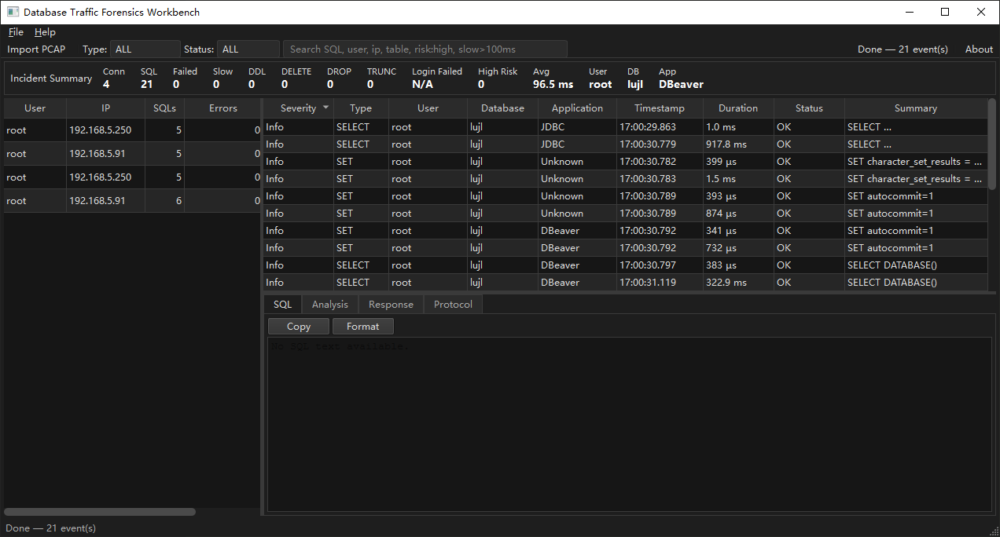
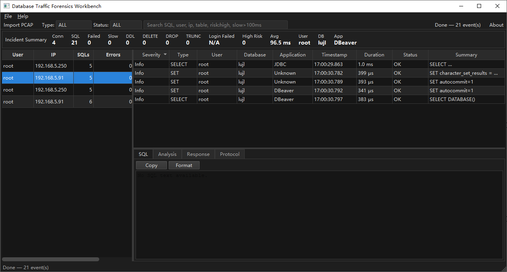
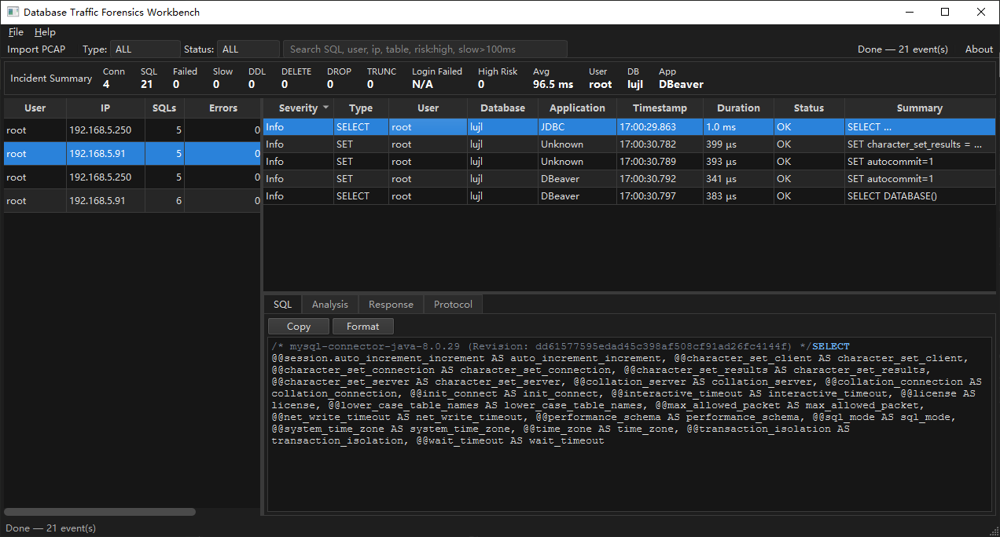

# DBForensics

**Desktop Database Traffic Analysis & Forensics**

Recover SQL statements and reconstruct database sessions directly from PCAP files.


DBForensics is a Windows desktop tool for investigating database traffic captured in PCAP and PCAPNG files. It helps DBAs, security engineers, incident response teams, digital forensics professionals, and packet analysis users understand database activity without deploying an agent or connecting to the database.



## Why DBForensics?

Traditional packet analyzers show packets.

DBForensics reconstructs database activity:

- Recover SQL statements from PCAP files
- Reconstruct database sessions and connections
- Investigate what happened during database activity
- Review SQL timelines, status, duration, and protocol metadata
- Work fully offline with no agent required

DBForensics is not a replacement for Wireshark. It is a focused database traffic investigation tool built for turning captured traffic into SQL sessions, events, and evidence.

## Features

- Import PCAP / PCAPNG
- MySQL protocol parser
- SQL session reconstruction
- SQL event timeline
- Incident summary dashboard
- SQL detail view
- Protocol detail view
- Sample PCAP included
- Windows desktop app
- Offline analysis

## Screenshots

### Incident Summary

High-level overview of connections, SQL count, slow SQL, DDL, risk indicators, and top users.


### SQL Events

Reconstructed SQL statements with user, database, application, timestamp, duration, and status.



### SQL Details

Inspect recovered SQL text and protocol metadata for investigation.



## Quick Start

Clone this repository:

```bash
git clone <repository-url>
cd dbforensics
```

Try the included sample PCAP:

```text
samples/91_95_mysql.pcap
```

Open the sample file in DBForensics to test session reconstruction and the SQL event timeline.

Public preview build coming soon.

## Demo

Watch a short preview of DBForensics reconstructing database traffic from a PCAP file:

[Watch demo video](assets/demo.mp4)

## Sample PCAP

This repository includes a sample MySQL PCAP file for testing:

```text
samples/91_95_mysql.pcap
```

Use it to test SQL session reconstruction, SQL event timelines, and database traffic review workflows.

## Supported Inputs

- `.pcap`
- `.pcapng`
- MySQL traffic
- Offline capture files

Encrypted database traffic is not supported unless it is decrypted before or during capture.

## Privacy & Security

DBForensics runs locally. PCAP files are analyzed offline and are not uploaded anywhere by the desktop application.

If you share PCAP files in Issues or Discussions, remove credentials, production data, hostnames, IP addresses, and other sensitive information first.

## Use Cases

- Database incident investigation
- SQL audit
- DBA troubleshooting
- Offline PCAP review
- Security investigation
- Digital forensics
- MySQL traffic analysis

## Current Limitations

DBForensics is an early MVP / public preview. UI behavior and analysis rules may change.

- MySQL is the current focus
- Offline PCAP analysis only
- Live capture is not supported yet
- Encrypted database traffic is not decoded
- Risk engine and report generation are planned
- PostgreSQL, Oracle, and SQL Server support are not available yet

## Roadmap

See the full roadmap: [docs/roadmap.md](docs/roadmap.md)

- [x] MySQL parser
- [x] SQL timeline
- [x] Incident summary
- [ ] Risk engine
- [ ] Report generator
- [ ] PostgreSQL support
- [ ] Oracle support
- [ ] Real-time capture

## FAQ

See the full FAQ: [docs/faq.md](docs/faq.md)

### Is DBForensics open source?

This repository is currently used for product information, documentation, releases, and feedback. The software itself is proprietary for now.

### Which databases are supported?

MySQL is the current focus.

### Does it require installing an agent?

No. DBForensics analyzes offline PCAP files.

### Is this a replacement for Wireshark?

No. Wireshark is a packet analyzer. DBForensics focuses on reconstructing database activity from traffic.

### Does it support live capture?

Not yet. Live capture is planned for a later version.

## Feedback

DBForensics is in early development. Feedback from DBAs, security engineers, incident responders, digital forensics professionals, and packet analysis users is welcome.

Useful feedback includes:

- Database type and version
- PCAP capture workflow
- Expected SQL reconstruction result
- Screenshot or description of the issue
- Windows version
- Whether the traffic is encrypted
- An anonymized sample PCAP, if possible

You can help by:

- Opening an Issue
- Starting a Discussion
- Suggesting database support
- Sharing PCAP analysis workflows
- Reporting reconstruction gaps

## License

This repository is used for product information, documentation, releases, and feedback.

The software itself is proprietary unless otherwise stated.

Sample files and documentation are provided for evaluation and feedback.
